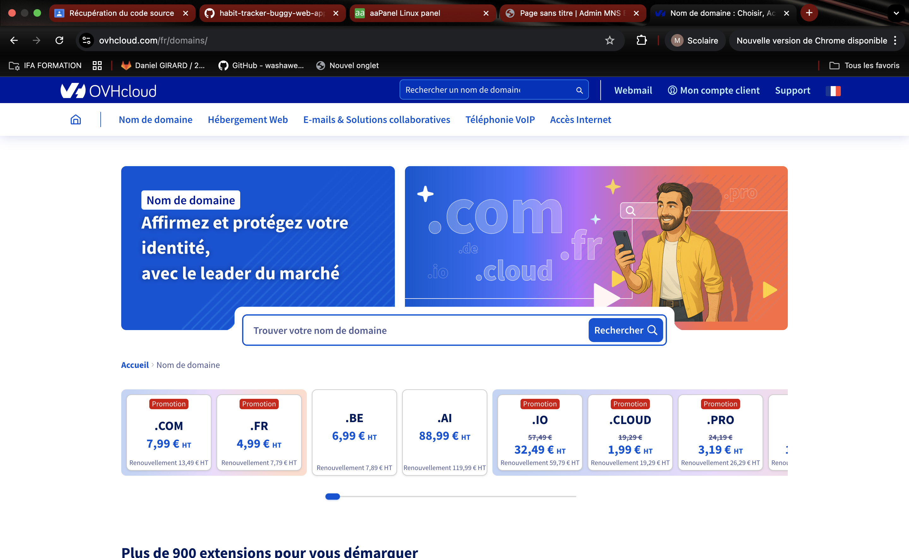
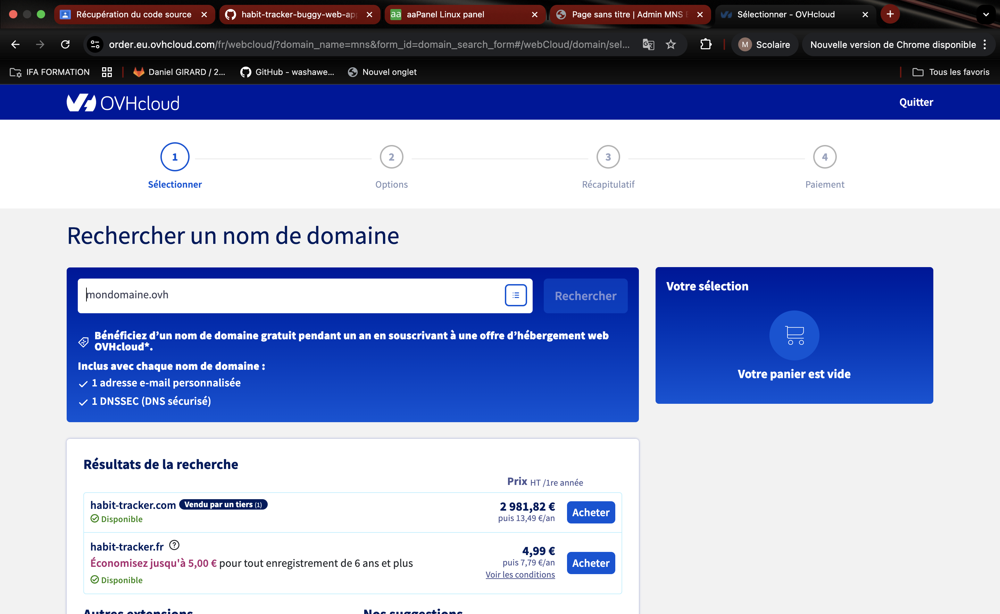
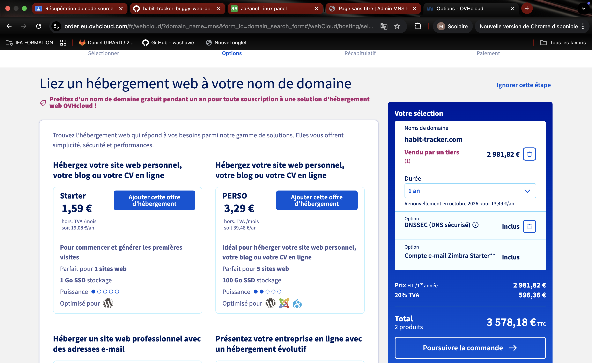
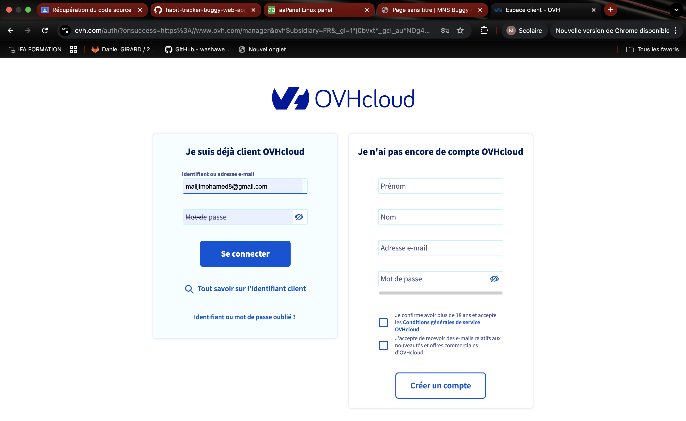
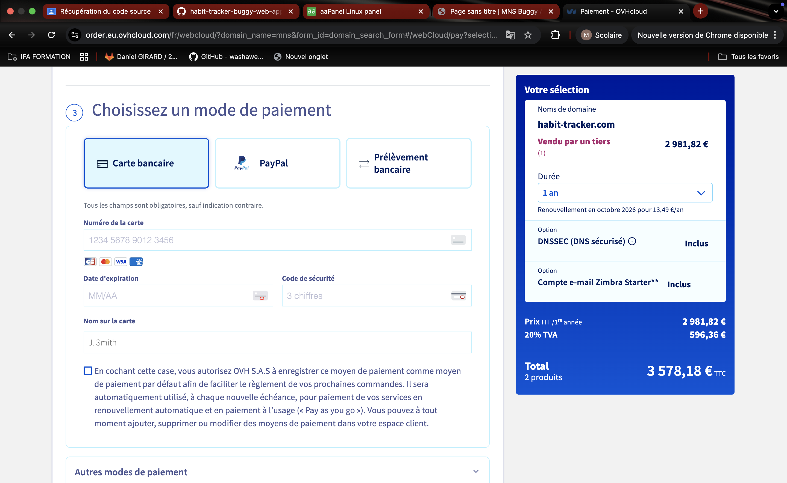

# Questions

Répondez ici aux questions théoriques en détaillant un maxium vos réponses :

## 1) Expliquer la procédure pour réserver un nom de domaine chez OVH avec des captures d'écran (arrêtez-vous au paiement) :

### Étapes détaillées pour réserver un nom de domaine chez OVH :

**Étape 1 : Accéder au site OVH**
- Se rendre sur https://www.ovhcloud.com/fr/
- Cliquer sur "Domaines" dans le menu principal



**Étape 2 : Rechercher la disponibilité du nom de domaine**
- Dans la barre de recherche, saisir le nom de domaine souhaité (sans extension)
- Le système affiche les extensions disponibles (.fr, .com, .net, etc.) avec leurs prix



**Étape 3 : Sélectionner l'extension souhaitée**
- Les noms disponibles sont marqués en vert
- Cliquer sur "Ajouter au panier" pour l'extension choisie



**Étape 4 : Configuration du domaine**
- Choisir la durée d'enregistrement (1, 2, 5 ou 10 ans)
- Sélectionner les options additionnelles :
  - Protection WHOIS : masque vos informations personnelles
  - Renouvellement automatique : évite la perte du domaine
  - DNS Anycast : améliore la performance DNS


**Étape 5 : Récapitulatif et panier**
- Vérifier le récapitulatif de commande avec prix HT et TTC
- Possibilité d'ajouter un code promo


**Étape 6 : Connexion ou création de compte**
- Connexion avec identifiant OVH existant
- Ou création de compte avec nom, email, mot de passe, adresse



**Étape 7 : Vérification des informations**
- Confirmer les informations du propriétaire 


**Étape 8 : Page de paiement (S'ARRÊTER ICI)**
- Choix du moyen de paiement : carte bancaire, PayPal, virement
- Acceptation des conditions générales
- Bouton "Procéder au paiement"



---

## 2. Comment faire pour qu'un nom de domaine pointe vers une adresse IP spécifique ?

### Configuration DNS détaillée :

**A. Accéder à l'interface de gestion DNS**

Chez OVH :
- Se connecter à l'espace client (https://www.ovh.com/manager/)
- Section "Web Cloud" > "Noms de domaine"
- Sélectionner le domaine
- Onglet "Zone DNS"

**B. Types d'enregistrements DNS**

- **A** : Associe un domaine à une IPv4 (ex: 192.168.1.1)
- **AAAA** : Associe un domaine à une IPv6
- **CNAME** : Crée un alias vers un autre domaine
- **MX** : Définit les serveurs mail

**C. Configurer l'enregistrement A**

Pour le domaine principal :
- Type : A
- Sous-domaine : @ ou www
- Cible : Adresse IP (ex: 203.0.113.45)
- TTL : 3600 (1 heure)

Pour un sous-domaine :
- Sous-domaine : api, app, etc.
- Type : A
- Cible : Adresse IP

**D. Exemple de configuration**

```
Type    Sous-domaine    Cible           TTL
A       @               203.0.113.45    3600
A       www             203.0.113.45    3600
A       api             203.0.113.45    3600
```

**E. Validation**
- Vérifier et sauvegarder
- Propagation DNS : 5 min à 48h

**F. Vérification**

Commandes terminal :
```bash
dig exemple.com
nslookup exemple.com
ping exemple.com
```

Outils en ligne :
- https://www.whatsmydns.net/
- https://dnschecker.org/

---

## 3. Comment mettre en place un certificat SSL ?

### Installation SSL/TLS pour sécuriser en HTTPS :

**A. Types de certificats**

1. **Let's Encrypt (Gratuit)** - Recommandé
   - Validation domaine
   - Renouvellement auto tous les 90 jours
   
2. **Certificats payants**
   - DV (Domain Validation) : 20-100€/an
   - OV (Organization Validation) : 50-200€/an
   - EV (Extended Validation) : 200-1000€/an
   - Wildcard (*.domaine.com) : prix variable

**B. Méthode Let's Encrypt avec Certbot**

Installation (Ubuntu/Debian) :
```bash
sudo apt update
sudo apt install certbot python3-certbot-nginx
```

Obtenir et installer le certificat :
```bash
sudo certbot --nginx -d exemple.com -d www.exemple.com
```

Pour Apache :
```bash
sudo apt install certbot python3-certbot-apache
sudo certbot --apache -d exemple.com -d www.exemple.com
```

Renouvellement automatique :
```bash
sudo certbot renew --dry-run
sudo crontab -e
# Ajouter :
0 3 * * * certbot renew --quiet --post-hook "systemctl reload nginx"
```

**C. Méthode via OVH**

1. Espace client OVH > "Web Cloud" > "Hébergement"
2. Onglet "Informations générales"
3. Section "Certificat SSL"
4. Commander certificat gratuit (Let's Encrypt) ou payant

**D. Configuration Nginx**

```nginx
server {
    listen 80;
    server_name exemple.com www.exemple.com;
    return 301 https://$server_name$request_uri;
}

server {
    listen 443 ssl http2;
    server_name exemple.com www.exemple.com;

    ssl_certificate /etc/letsencrypt/live/exemple.com/fullchain.pem;
    ssl_certificate_key /etc/letsencrypt/live/exemple.com/privkey.pem;
    
    ssl_protocols TLSv1.2 TLSv1.3;
    add_header Strict-Transport-Security "max-age=31536000" always;
    
    root /var/www/html;
    index index.php index.html;
}
```

**E. Configuration Apache**

```apache
<VirtualHost *:80>
    ServerName exemple.com
    Redirect permanent / https://exemple.com/
</VirtualHost>

<VirtualHost *:443>
    ServerName exemple.com
    
    SSLEngine on
    SSLCertificateFile /etc/letsencrypt/live/exemple.com/fullchain.pem
    SSLCertificateKeyFile /etc/letsencrypt/live/exemple.com/privkey.pem
    
    SSLProtocol all -SSLv3 -TLSv1 -TLSv1.1
    Header always set Strict-Transport-Security "max-age=31536000"
    
    DocumentRoot /var/www/html
</VirtualHost>
```

**F. Vérification**

Navigateur :
- Accéder à https://exemple.com
- Cliquer sur le cadenas
- Vérifier émetteur et validité

Test en ligne :
- SSL Labs : https://www.ssllabs.com/ssltest/

Ligne de commande :
```bash
openssl s_client -connect exemple.com:443
```

